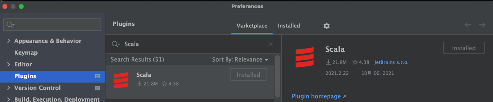

Chisel 代码模版
=======================
# 文件组织方式
## src

用于写模块代码与测试代码，其中在main文件夹内编写类与模块，在test文件夹内编写测试样例

## Makefile

提供了简易的命令：

`make verilog` : 在项目主目录生成verilog代码

`make test` : 运行test文件夹内的测试样例

`make testall` : 运行所有测试样例

`make clean` : 删除所有生成的firrtl、verilog、anno.json文件

## build.sbt

项目资源配置文件

# sbt 运行参数说明
> TODO (孟令达)

# 教程资源：

[Chisel Bootcamp](https://github.com/freechipsproject/chisel-bootcamp)

[Chisel3](https://www.chisel-lang.org/chisel3/docs/introduction.html)

[ChiselTest首页](https://www.chisel-lang.org/chiseltest/)

[chiseltest repo(包含更多例子)](https://github.com/ucb-bar/chisel-testers2/tree/master/src/test/scala/chiseltest/tests)

[SBT docs](https://www.scala-sbt.org/1.x/docs/Testing.html)

[scala结构体](https://www.scala-sbt.org/1.x/docs/Directories.html)

[scala命名规则](http://docs.scala-lang.org/style/naming-conventions.html)

# 环境配置

推荐使用IntelliJ IDEA 社区版

首先在插件中安装`Scala` 插件

然后用IDE打开本项目，IDE会根据`build.sbt`下载相应的库与文件即可使用。